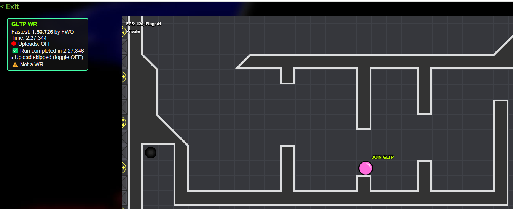

# GLTP Speedrun Uploader

A Tampermonkey userscript for [TagPro](https://tagpro.koalabeast.com) private groups that automatically uploads speedrun replays to the GLTP tracker and displays a WR HUD overlay.

## Important Notes
- The in‑game timer is **not perfectly accurate**. It is meant for live display only and is **not the source of truth** for GLTP speedruns.  
- A margin of about **3 seconds** is applied when comparing your run time against the fastest recorded time to account for timing differences in the client.
- Can take up to **1.5 hours** for replay to process after upload. 

## Features
- **WR HUD overlay**: Shows current world record time and holder.
- **Least Jumps record**: Displays the minimum jumps achieved on the map and the player who set it.
- **Live timer**: Speedrun‑style timer during runs. Syncs to game clock in joining mid game
- **Replay upload**: Queues completed runs to the GLTP tracker (toggleable).
- **Menu toggle**: Enable/disable uploads via Tampermonkey menu.
- **Replay‑safe**: Overlay works while watching replays and spectating, but uploads are skipped.
- **Draggable HUD**: Position is saved between sessions.
- **Only runs for valid GLTP maps**: uses gltp spreadsheet for map data

## Installation
1. Install [Tampermonkey](https://www.tampermonkey.net/) in your browser.
2. Copy the raw script URL from this repo.
3. Add it as a new userscript in Tampermonkey.
4. The script will auto‑update if you include `@updateURL` and `@downloadURL` headers pointing to the github raw file.

## Usage
- Join a private group game on TagPro with a supported speedrun map.
- The WR HUD will appear automatically.
- Toggle uploads on/off via the Tampermonkey menu.
- Completed runs are queued to the GLTP tracker unless uploads are disabled or you’re watching a replay.
- If you refresh mid‑game, the timer will resume from the correct elapsed time thanks to persisted runStart.
- Make sure this script is allowed in your league of play before using it

## HUD Overlay

## Menu Toggle
turn this on/off to change if uploads happen automatically at the end of a run

## Resources
- TagPro wiki on mods and enhancements: [Quick Guide](https://www.reddit.com/r/TagPro/wiki/quickguide-mods-and-enhancements/)
- GLTP speedrun website: [GLTP](https://bambitp.github.io/GLTP/)
- Maps spreadsheet: [Speedrun Maps](https://docs.google.com/spreadsheets/d/1OnuTCekHKCD91W39jXBG4uveTCCyMxf9Ofead43MMCU/edit?gid=1775606307#gid=1775606307)

## Changelog

### v1.3
- Added **Least Jumps record** to HUD overlay (shows minJumps and player_jumps from WR data). previous versions now broken
- Fixed **duplicate upload issue**: now only one upload per run completion, even if more captures occur.
- Implemented **persistent runStart storage** using absolute timestamps and UUID checks, so the timer resumes correctly after refresh.
- Added logging lines to aid debugging.